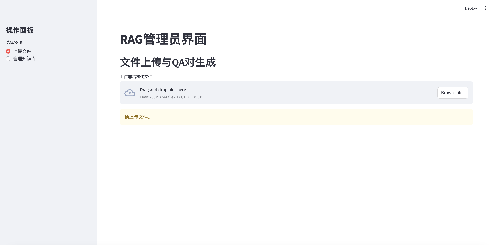
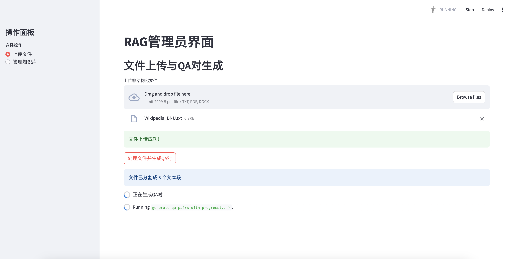
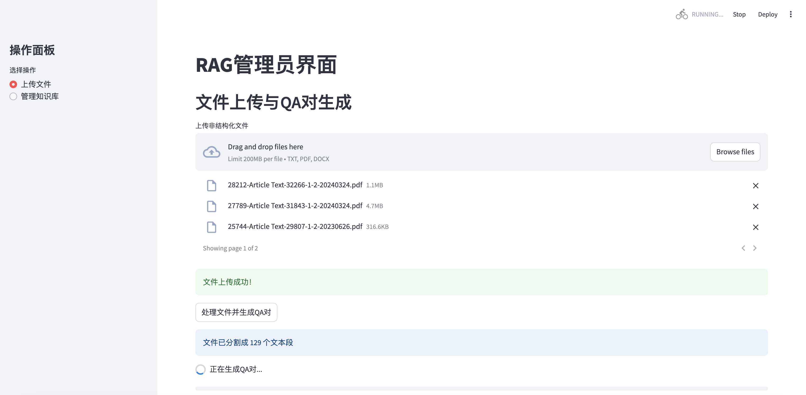
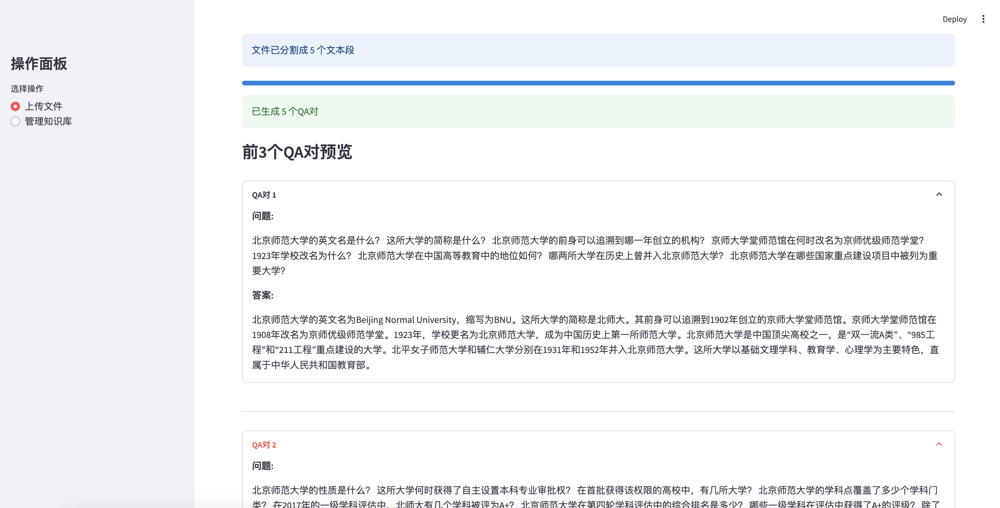
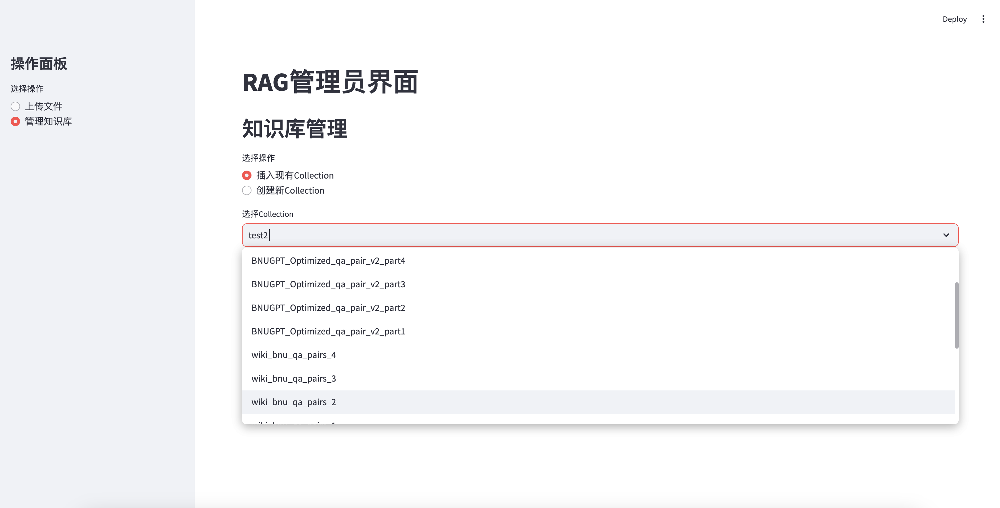
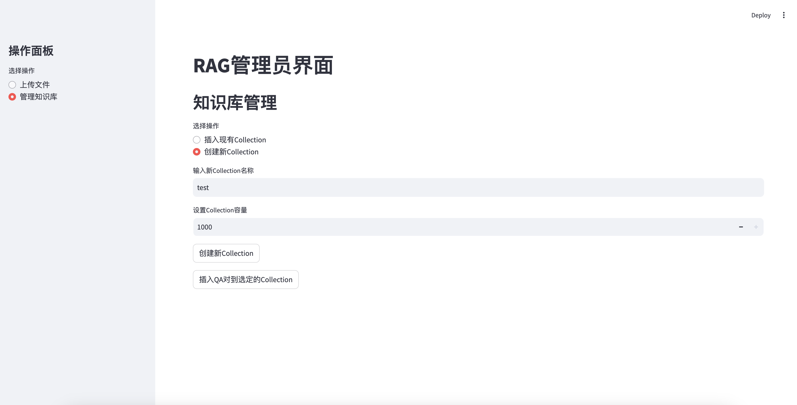
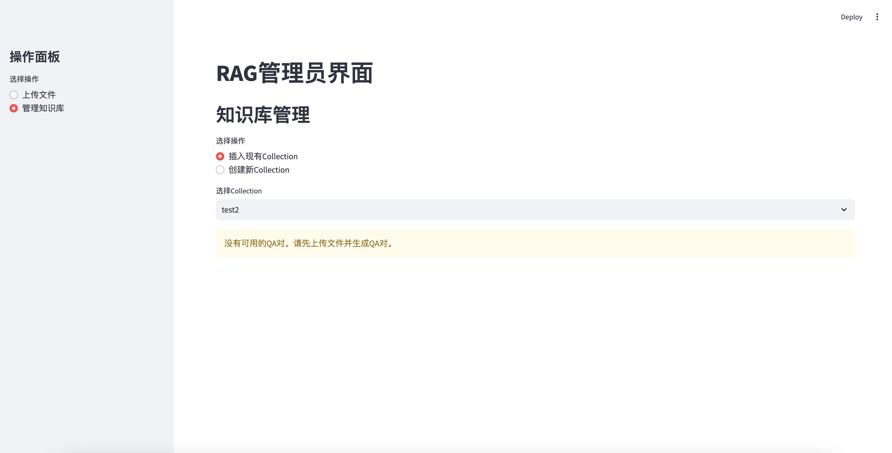
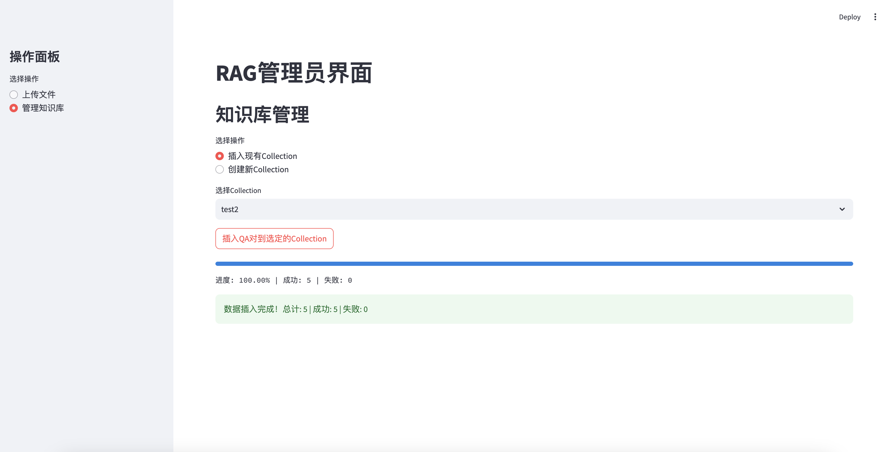
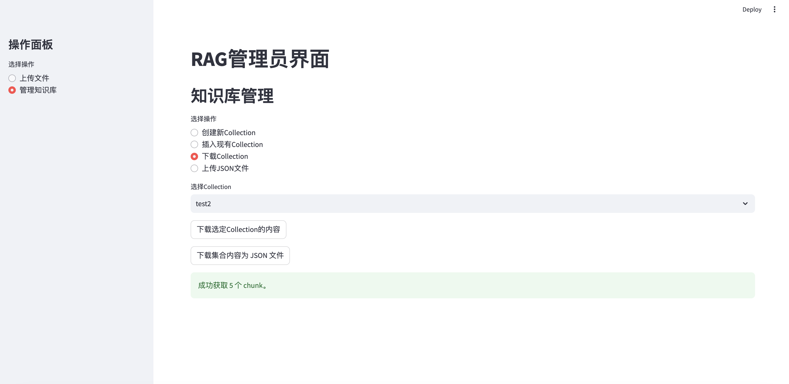
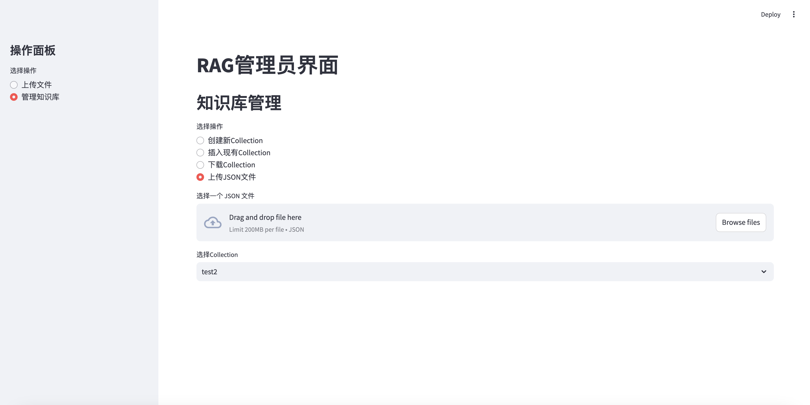

# 一、背景介绍
检索增强生成（RAG）系统已成为人工智能领域的一个重要发展方向，它结合了大规模语言模型的生成能力和外部知识库的精确信息，以提供更准确、更可靠的回答。然而，构建和维护RAG系统的知识库一直是一个耗时且复杂的过程，特别是在处理大量非结构化文档时。最近，我们正在为一个检索增强生成（RAG）系统开发一个自动化的问答（QA）生成工具。这个项目旨在缓解上述挑战，通过自动化流程将各种格式的文档转化为结构化的问答对，并将它们无缝集成到RAG系统的知识库中。

# 二、提出动机
本项目源于实际RAG系统开发中遇到的挑战，其中大致的动机有以下几点：
- **提高效率**：传统方法要么效果不佳，要么耗时过多，我们需要一种能够快速处理大量文档的方法。
- **提升质量**：利用大模型的智能性，我们希望生成的问答对能够更加贴合文本内容，提高知识库的质量。
- **减少人工干预**：通过自动化流程，我们旨在最小化人工参与，从而降低人为错误和主观偏差。
- **灵活适应**：我们需要一个系统能够处理各种格式的文档，并适应不同领域的知识需求。
- **用户友好**：即使是非技术人员也应该能够轻松使用这个系统，参与到知识库的构建和管理中。

# 三、技术方案
特别的，我们整体的技术方案可以归结为下面的几个部分：
- **文档处理**：使用langchain_community的document_loaders库来处理各种格式的文档（txt、pdf、docx），并基于此将其分割成适当大小的文本块。
- **AI驱动的QA生成**：利用OpenAI的API（在本案例中使用qwen2.5-72b模型）自动生成高质量的问答对。通过精心设计的prompt，确保生成的问答对紧密围绕文本内容。
- **知识库管理**：实现了一个灵活的集合管理系统，允许创建新的集合或选择现有集合来存储生成的QA对。使用RESTful API与后端数据库进行交互，实现数据的存储和检索。
- **用户界面**：基于Streamlit构建了一个直观、用户友好的Web界面。该界面提供了文件上传、QA对生成预览、知识库管理等功能，使整个过程变得简单明了。
- **进度跟踪和错误处理**：实现了详细的进度显示和错误处理机制，确保用户能够实时了解处理进展，并在出现问题时得到及时反馈。
- **缓存优化**：使用Streamlit的@st.cache_data装饰器来优化性能，特别是在QA对生成过程中。
- **安全性考虑**：使用临时文件处理上传的文档，处理后立即删除，以确保数据安全。

# 四、安装与使用
## 4.1 先决条件
- streamlit==1.22.0
- requests==2.31.0
- openai==0.28.0
- langchain==0.10.0
- PyMuPDF==1.22.5
- pandas==2.1.1
- langchain_community==0.1.0

## 4.2 安装步骤
- 克隆此仓库：
```
git clone https://github.com/wangxb96/RAG-QA-Generator.git
cd RAG-QA-Generator
```
- 安装依赖项：
```
pip install -r requirements.txt
``` 
- 配置API密钥和基础URL：
```
base_url = 'http://your-api-url/v1/'
api_key = 'your-api-key'
headers = {"Authorization": f"Bearer {api_key}"}

client = OpenAI(
    api_key="your-openai-api-key",
    base_url="http://your-openai-api-url/v1",
)
```

## 4.3 运行应用
- 启动Streamlit应用：
```
streamlit run AutoQAG.py
```
- 打开浏览器并访问 http://localhost:8501。
 
## 4.4 页面概览
应用界面分为两个主要部分：
- **左侧边栏**：用于选择操作（上传文件或管理知识库）
- **主界面**：显示当前操作的详细内容和交互元素


_RAG管理主页面_

## 4.5 上传文件
- 在左侧边栏选择“上传文件”操作。
- 在主界面中，使用文件上传器上传非结构化文件（支持txt、pdf、docx格式）。
- 文件上传成功后，点击“处理文件并生成QA对”按钮。
-  系统将处理文件并生成QA对，显示进度条和结果摘要。
- 生成完成后，可以预览前3个QA对。


_文件上传与QA对生成_


_更新版本支持多个文件上传_


_预览生成的前3个QA对_

## 4.6 管理知识库
- 在左侧边栏选择“管理知识库”操作。
- 选择“*插入现有Collection*”或“*创建新Collection*”。
   - 插入现有Collection：
     - 从下拉列表中选择一个现有的Collection。
   - 创建新Collection：
     - 输入新Collection的名称。
     - 设置Collection的容量（1-1000之间）。
     - 点击“创建新Collection”按钮。


_插入现有知识库_


_插入新创建的知识库_

## 4.7 插入QA对到Collection
- 确保已经上传文件并生成了QA对。
- 在知识库管理界面，选择或创建一个Collection。
- 点击“插入QA对到选定的Collection”按钮。
- 系统将显示插入进度和结果摘要。


_没有生成QA时无法插入_


_插入知识库成功_

## 4.8 下载Collection或上传Collection
- 在知识库管理界面，选择一个Collection。
- 点击“下载选定的Collection的内容”按钮。
- 系统将显示获取的chunk数目。
- 点击“下载集合内容为JSON文件"下载对应Collection


_下载Collection_


_上传JSON文件到Collection_

# 五、技术实现
## 5.1 配置和初始化
首先，我们设置了必要的配置和初始化：
```python
base_url = 'your_knowledgebase_base_url'
api_key = 'your_knowledgebase_api_key'
headers = {"Authorization": f"Bearer {api_key}"}

client = OpenAI(
    api_key="your_llm_api_key",
    base_url="your_llm_base_url",
)
```
这部分设置了API的基础URL和认证信息，以及OpenAI客户端的配置。
## 5.2 核心功能函数
### 5.2.1 文本处理与问答对生成
- **get_completion**: 调用模型生成响应。
- **generate_qa_pairs_with_progress**: 生成问答对并显示进度。

#### 5.2.1.1 get_completion(prompt, model="qwen25-72b")
**功能**: 获取模型的响应。

**参数**:
- `prompt`: 要发送给模型的文本提示。
- `model`: 使用的模型名称，默认为"qwen25-72b"。

**返回**: 返回模型生成的响应内容。如果调用API时发生错误，则返回None。
```python
def get_completion(prompt, model="qwen25-72b"):
    """获取模型的响应"""
    try:
        response = client.chat.completions.create(
            model=model,
            messages=[{"role": "user", "content": prompt}],
            temperature=0,
        )
        return response.choices[0].message.content
    except Exception as e:
        st.error(f"调用API时发生错误: {e}")
        return None
```

#### 5.2.1.2 generate_qa_pairs_with_progress(text_chunks)
**功能**: 这个函数基于文本块生成QA对（这里可以设计更好的QA生成策略，通过调整prompt实现更好的生成）。

**参数**:

- `text_chunks`: 文本块的列表，用于生成问答对。
**返回**: 返回生成的问答对列表。
```python
def generate_qa_pairs_with_progress(text_chunks):
    """生成问答对并显示进度"""
    qa_pairs = []
    progress_bar = st.progress(0)
    for i, chunk in enumerate(text_chunks):
        prompt = f"""基于以下给定的文本，生成一组高质量的问答对。请遵循以下指南：
        
                1. 问题部分：
                - 为同一个主题创建尽可能多的（如K个）不同表述的问题，确保问题的多样性。
                - 每个问题应考虑用户可能的多种问法，例如：
                - 直接询问（如“什么是...？”）
                - 请求确认（如“是否可以说...？”）
                - 寻求解释（如“请解释一下...的含义。”）
                - 假设性问题（如“如果...会怎样？”）
                - 例子请求（如“能否举个例子说明...？”）
                - 问题应涵盖文本中的关键信息、主要概念和细节，确保不遗漏重要内容。

                2. 答案部分：
                - 提供一个全面、信息丰富的答案，涵盖问题的所有可能角度，确保逻辑连贯。
                - 答案应直接基于给定文本，确保准确性和一致性。
                - 包含相关的细节，如日期、名称、职位等具体信息，必要时提供背景信息以增强理解。

                3. 格式：
                - 使用 "Q:" 标记问题集合的开始，所有问题应在一个段落内，问题之间用空格分隔。
                - 使用 "A:" 标记答案的开始，答案应清晰分段，便于阅读。
                - 问答对之间用两个空行分隔，以提高可读性。

                4. 内容要求：
                - 确保问答对紧密围绕文本主题，避免偏离主题。
                - 避免添加文本中未提及的信息，确保信息的真实性。
                - 如果文本信息不足以回答某个方面，可以在答案中说明 "根据给定信息无法确定"，并尽量提供相关的上下文。

                5. 示例结构（仅供参考，实际内容应基于给定文本）：
                
            给定文本：
            {chunk}

            请基于这个文本生成问答对。
            """
        response = get_completion(prompt)
        if response:
            try:
                parts = response.split("A:", 1)
                if len(parts) == 2:
                    question = parts[0].replace("Q:", "").strip()
                    answer = parts[1].strip()
                    qa_pairs.append({"question": question, "answer": answer})
                else:
                    st.warning(f"无法解析响应: {response}")
            except Exception as e:
                st.warning(f"处理响应时出错: {str(e)}")
        
        progress = (i + 1) / len(text_chunks)
        progress_bar.progress(progress)
    
    return qa_pairs
```

### 5.2.2 API请求处理
- **api_request**: 处理通用的API请求。
- **create_collection**: 创建新集合。
- **create_chunk**: 创建数据块。
- **list_chunks**: 列出集合中的数据块。
- **get_chunk_details**: 获取特定数据块的详细信息。
- **fetch_all_chunks_from_collection**: 从集合中获取所有数据块。

#### 5.2.2.1 api_request(method, url, **kwargs)
**功能**: 处理通用的API请求。

**参数**:
- `method`: HTTP请求方法（如GET、POST等）。
- `url`: 请求的URL。
- `kwargs`: 其他请求参数（如headers、json等）。
**返回**: 返回API响应中的“data”部分。如果请求失败，则显示错误信息并返回None。
```python
def api_request(method, url, **kwargs):
    try:
        response = requests.request(method, url, headers=headers, **kwargs)
        response.raise_for_status()
        return response.json().get('data')
    except requests.RequestException as e:
        st.error(f"API请求失败: {e}")
        return None
```

#### 5.2.2.2 create_collection(name, embedding_model_id, capacity)
**功能**: 创建新集合。

**参数**:
- `name`: 集合的名称。
- `embedding_model_id`: 嵌入模型的ID。
- `capacity`: 集合的容量。
**返回**: 返回创建的集合的响应数据。
```python
def create_collection(name, embedding_model_id, capacity):
    data = {
        "name": name,
        "embedding_model_id": embedding_model_id,
        "capacity": capacity
    }
    return api_request("POST", f"{base_url}collections", json=data)
```

#### 5.2.2.3 create_chunk(collection_id, content)
**功能**: 创建数据块。

**参数**:
- `collection_id`: 集合的ID。
- `content`: 数据块的内容。
**返回**: 返回创建的数据块的响应数据。如果请求失败，则显示错误信息并返回None。
```python
def create_chunk(collection_id, content):
    data = {
        "collection_id": collection_id,
        "content": content
    }
    endpoint = f"{base_url}collections/{collection_id}/chunks"
    try:
        response = requests.post(endpoint, headers=headers, json=data)
        response.raise_for_status()
        return response.json()['data']
    except requests.RequestException as e:
        st.error(f"创建chunk失败: {e}")
        return None
```


#### 5.2.2.4 list_chunks(collection_id, limit=20, after=None)
**功能**: 列出指定集合中的数据块。

**参数**:
- `collection_id`: 集合的ID。
- `limit`: 返回的数据块数量限制，默认为20。
- `after`: 用于分页的参数，指定从哪个数据块开始。
**返回**: 返回数据块的列表。如果请求失败，则显示错误信息并返回空列表。
```python
def list_chunks(collection_id, limit=20, after=None):
    url = f"{base_url}collections/{collection_id}/chunks"   
    params = {
        "limit": limit,
        "order": "desc"
    }
    if after:
        params["after"] = after

    response = api_request("GET", url, params=params)
    if response is not None:
        return response
    else:
        st.error("列出 chunks 失败。")
        return []
```

#### 5.2.2.5 get_chunk_details(chunk_id, collection_id)
**功能**: 获取特定数据块的详细信息。

**参数**:
- `chunk_id`: 数据块的ID。
- `collection_id`: 集合的ID。
**返回**: 返回数据块的详细信息。如果请求失败，则显示错误信息并返回None。
```python
def get_chunk_details(chunk_id, collection_id):
    url = f"{base_url}collections/{collection_id}/chunks/{chunk_id}" 
    response = api_request("GET", url)
    if response is not None:
        return response
    else:
        st.error("获取 chunk 详细信息失败。")
        return None
```

#### 5.2.2.6 fetch_all_chunks_from_collection(collection_id)
**功能**: 从指定集合中获取所有数据块。

**参数**:
- `collection_id`: 集合的ID。 
**返回**: 返回所有数据块的详细信息列表。
```python
def fetch_all_chunks_from_collection(collection_id):
    all_chunks = []
    after = None

    while True:
        chunk_list = list_chunks(collection_id, after=after)
        if not chunk_list:
            break
        for chunk in chunk_list:
            chunk_id = chunk['chunk_id']
            chunk_details = get_chunk_details(chunk_id, collection_id)
            if chunk_details:
                all_chunks.append(chunk_details)
        if len(chunk_list) < 20:
            break
        after = chunk_list[-1]['chunk_id']
    return all_chunks
```

### 5.2.3 文件处理
- **load_single_document**: 加载单个文档。
- **process_file**: 处理上传的文件并生成文本块。
- **process_files**: 处理多个上传的文件并生成文本块。

#### 5.2.3.1 load_single_document(file_path: str) -> List[Document]
**功能**: 加载单个文档。
**参数**:
- `file_path`: 文档的文件路径。 
**返回**: 返回加载的文档列表。如果文件扩展名不受支持，则抛出ValueError。
```python
def load_single_document(file_path: str) -> List[Document]:
    ext = "." + file_path.rsplit(".", 1)[-1]
    if ext in LOADER_MAPPING:
        loader_class, loader_args = LOADER_MAPPING[ext]
        loader = loader_class(file_path, **loader_args)
        return loader.load()
    raise ValueError(f"Unsupported file extension '{ext}'")
```

#### 5.2.3.2 process_file(uploaded_file)
**功能**: 处理上传的文件并生成文本块。
**参数**:
- `uploaded_file`: 上传的文件对象。
**返回**: 返回生成的文本块列表。如果文件处理失败，则返回空列表。
```python
def process_file(uploaded_file):
    with tempfile.NamedTemporaryFile(delete=False, suffix=os.path.splitext(uploaded_file.name)[1]) as tmp_file:
        tmp_file.write(uploaded_file.getvalue())
        tmp_file_path = tmp_file.name
    try:
        documents = load_single_document(tmp_file_path)
        if not documents:
            st.error("文件处理失败，请检查文件格式是否正确。")
            return []

        text_splitter = RecursiveCharacterTextSplitter(chunk_size=2000, chunk_overlap=500)
        text_chunks = text_splitter.split_documents(documents)
        return text_chunks
    except Exception as e:
        st.error(f"处理文件时发生错误: {e}")
        return []
    finally:
        os.unlink(tmp_file_path)
```

#### 5.2.3.4 process_files(uploaded_files)
**功能**: 处理上传的多个文件并生成文本块。
**参数**:
- `uploaded_files`: 上传的文件对象列表。
**返回**: 返回所有生成的文本块列表。
```python
def process_files(uploaded_files):
    all_text_chunks = []
    for uploaded_file in uploaded_files:
        with tempfile.NamedTemporaryFile(delete=False, suffix=os.path.splitext(uploaded_file.name)[1]) as tmp_file:
            tmp_file.write(uploaded_file.getvalue())
            tmp_file_path = tmp_file.name
        try:
            documents = load_single_document(tmp_file_path)
            if not documents:
                st.error(f"文件 {uploaded_file.name} 处理失败，请检查文件格式是否正确。")
                continue

            text_splitter = RecursiveCharacterTextSplitter(chunk_size=2000, chunk_overlap=500)
            text_chunks = text_splitter.split_documents(documents)
            all_text_chunks.extend(text_chunks)
        except Exception as e:
            st.error(f"处理文件 {uploaded_file.name} 时发生错误: {e}")
        finally:
            os.unlink(tmp_file_path)
    
    return all_text_chunks
```

### 5.2.4 问答对数据库管理
- **insert_qa_pairs_to_database**: 将问答对插入到数据库。
#### 5.2.4.1 insert_qa_pairs_to_database(collection_id)
**功能**: 将问答对插入到数据库。

**参数**:
- `collection_id`: 要插入问答对的集合ID。
**返回**: 返回成功插入的问答对数量和失败的数量。
```python
def insert_qa_pairs_to_database(collection_id):
    progress_bar = st.progress(0)
    status_text = st.empty()
    success_count = 0
    fail_count = 0
    for i, qa_pair in enumerate(st.session_state.qa_pairs):
        try:
            if "question" in qa_pair and "answer" in qa_pair and "chunk" in qa_pair:
                content = f"问题：{qa_pair['question']}\n答案：{qa_pair['answer']}\n原文：{qa_pair['chunk']}"
                if len(content) > 4000:
                    content = content[:4000]
                if create_chunk(collection_id=collection_id, content=content):
                    success_count += 1
                else:
                    fail_count += 1
                    st.warning(f"插入QA对 {i+1} 失败")
            else:
                fail_count += 1
                st.warning(f"QA对 {i+1} 格式无效")
        except Exception as e:
            st.error(f"插入QA对 {i+1} 时发生错误: {str(e)}")
            fail_count += 1
        
        progress = (i + 1) / len(st.session_state.qa_pairs)
        progress_bar.progress(progress)
        status_text.text(f"进度: {progress:.2%} | 成功: {success_count} | 失败: {fail_count}")

    return success_count, fail_count
```


### 5.2.5 数据下载与上传
- **download_chunks_as_json**: 将数据块下载为JSON文件。
- **upload_json_chunks**: 从JSON文件上传数据块到指定集合。

#### 5.2.5.1 download_chunks_as_json(chunks, collection_name)
**功能**: 将数据块下载为JSON文件，并进行清晰的格式化。

**参数**:
- `chunks`: 数据块的列表。
- `collection_name`: 集合的名称，用于生成下载文件的名称。
**返回**: 无返回值，直接提供下载按钮。
```python
def download_chunks_as_json(chunks, collection_name):
    if chunks:
        json_data = {"chunks": []}
        for chunk in chunks:
            json_data["chunks"].append({
                "chunk_id": chunk.get("chunk_id"),
                "record_id": chunk.get("record_id"),
                "collection_id": chunk.get("collection_id"),
                "content": chunk.get("content"),
                "num_tokens": chunk.get("num_tokens"),
                "metadata": chunk.get("metadata", {}),
                "updated_timestamp": chunk.get("updated_timestamp"),
                "created_timestamp": chunk.get("created_timestamp"),
            })
        
        json_str = json.dumps(json_data, ensure_ascii=False, indent=4)
        
        st.download_button(
            label="下载集合内容为 JSON 文件",
            data=json_str,
            file_name=f"{collection_name}.json",
            mime="application/json"
        )
```

#### 5.2.5.2 upload_json_chunks(uploaded_json_file, collection_id)
**功能**: 从JSON文件上传数据块到指定集合。

**参数**:
- `uploaded_json_file`: 上传的JSON文件对象。
- `collection_id`: 要上传数据块的集合ID。
**返回**: 无返回值，直接在界面上显示上传进度和结果。
```python
def upload_json_chunks(uploaded_json_file, collection_id):
    try:
        data = json.load(uploaded_json_file)
        
        if 'chunks' not in data:
            st.error("JSON 文件中缺少 'chunks' 键。")
            return
        
        chunks = data['chunks']
        total_records = len(chunks)
        records_per_collection = 1000
        num_collections = math.ceil(total_records / records_per_collection)

        st.write(f"总记录数: {total_records}")
        st.write(f"每个集合的记录数: {records_per_collection}")
        st.write(f"需要创建的集合数: {num_collections}")

        for i in range(num_collections):
            st.write(f"\n导入集合 {i+1}/{num_collections}...")
            start_index = i * records_per_collection
            end_index = min((i + 1) * records_per_collection, total_records)
            
            progress_bar = st.progress(0)
            for j, chunk in enumerate(chunks[start_index:end_index]):
                if 'content' in chunk:
                    content = chunk['content']
                    try:
                        create_chunk(
                            collection_id=collection_id,
                            content=content
                        )
                    except Exception as e:
                        st.error(f"创建 chunk 时出错: {str(e)}")
                        break
                else:
                    st.warning(f"第 {start_index + j + 1} 条记录缺少 'content' 键。")
                    continue

                progress = (j + 1) / (end_index - start_index)
                progress_bar.progress(progress)

        st.success("所有数据导入完成。")
    except Exception as e:
        st.error(f"上传 JSON 文件时发生错误: {str(e)}")
```
  
### 5.3 主页面结构
主界面结构在main()函数中定义：
```python
def main():
    st.set_page_config(page_title="RAG管理员界面", layout="wide")
    st.title("RAG管理员界面")

    # 侧边栏
    st.sidebar.title("操作面板")
    operation = st.sidebar.radio("选择操作", ["上传文件", "管理知识库"])

    if operation == "上传文件":
        # 文件上传和处理逻辑
        ...
    elif operation == "管理知识库":
        # 知识库管理逻辑
        ...

if __name__ == "__main__":
    main()
```

### 5.4 文件上传和处理
```python
if operation == "上传文件":
        st.header("文件上传与QA对生成")
        uploaded_files = st.file_uploader("上传非结构化文件", type=["txt", "pdf", "docx"], accept_multiple_files=True)
        if uploaded_files:
            st.success("文件上传成功！")
            
            if st.button("处理文件并生成QA对"):
                with st.spinner("正在处理文件..."):
                    text_chunks = process_files(uploaded_files)
                    if not text_chunks:
                        st.error("文件处理失败，请检查文件格式是否正确。")
                        return
                    st.info(f"文件已分割成 {len(text_chunks)} 个文本段")

                with st.spinner("正在生成QA对..."):
                    st.session_state.qa_pairs = generate_qa_pairs_with_progress(text_chunks)
                    st.success(f"已生成 {len(st.session_state.qa_pairs)} 个QA对")

                if st.session_state.qa_pairs:
                    st.subheader("前3个QA对预览")
                    cols = st.columns(3)
                    for i, qa in enumerate(st.session_state.qa_pairs[:3]):
                        with st.expander(f"**QA对 {i + 1}**", expanded=True):
                            st.markdown("**问题:**")
                            st.markdown(qa['question'])
                            st.markdown("**答案:**")
                            st.markdown(qa['answer'])
                            st.markdown("**原文:**")
                            st.markdown(qa['chunk'])
                        st.markdown("---") 
        else:
            st.warning("请上传文件。")
```

### 5.5 知识库管理
```python
elif operation == "管理知识库":
        st.header("知识库管理")
        option = st.radio("选择操作", ("创建新Collection", "插入现有Collection", "下载Collection", "上传JSON文件"))
        
        if option == "插入现有Collection":
            if st.session_state.collections:
                collection_names = [c['name'] for c in st.session_state.collections]
                selected_collection = st.selectbox("选择Collection", collection_names)
                selected_id = next(c['collection_id'] for c in st.session_state.collections if c['name'] == selected_collection)

                if st.button("插入QA对到选定的Collection"):
                    if hasattr(st.session_state, 'qa_pairs') and st.session_state.qa_pairs:
                        with st.spinner("正在插入QA对..."):
                            success_count, fail_count = insert_qa_pairs_to_database(selected_id)
                            st.success(f"数据插入完成！总计: {len(st.session_state.qa_pairs)} | 成功: {success_count} | 失败: {fail_count}")
                    else:
                        st.warning("没有可用的QA对。请先上传文件并生成QA对。")
            else:
                st.warning("没有可用的 Collections，请创建新的 Collection。")

        elif option == "创建新Collection":
            new_collection_name = st.text_input("输入新Collection名称")
            capacity = st.number_input("设置Collection容量", min_value=1, max_value=1000, value=1000)
            if st.button("创建新Collection"):
                with st.spinner("正在创建新Collection..."):
                    new_collection = create_collection(
                        name=new_collection_name,
                        embedding_model_id=embedding,  # 这里可以替换为实际的模型ID
                        capacity=capacity
                    )
                    if new_collection:
                        st.success(f"新Collection创建成功，ID: {new_collection['collection_id']}")
                        # 立即更新 collections 列表
                        st.session_state.collections = api_request("GET", f"{base_url}collections")
                        st.rerun()
                    else:
                        st.error("创建新Collection失败")

        elif option == "下载Collection":
            if st.session_state.collections:
                collection_names = [c['name'] for c in st.session_state.collections]
                selected_collection = st.selectbox("选择Collection", collection_names)
                selected_id = next(c['collection_id'] for c in st.session_state.collections if c['name'] == selected_collection)

                if st.button("下载选定Collection的内容"):
                    with st.spinner("正在获取集合内容..."):
                        chunks = fetch_all_chunks_from_collection(selected_id)  # Pass the API key
                        if chunks:
                            download_chunks_as_json(chunks, selected_collection)  # Pass the collection name
                            st.success(f"成功获取 {len(chunks)} 个 chunk。")
                        else:
                            st.error("未能获取集合内容。")
            else:
                st.warning("没有可用的 Collections，请创建新的 Collection。")

        elif option == "上传JSON文件":
            uploaded_json_file = st.file_uploader("选择一个 JSON 文件", type=["json"])
            
            if st.session_state.collections:
                collection_names = [c['name'] for c in st.session_state.collections]
                selected_collection = st.selectbox("选择Collection", collection_names)
                selected_id = next(c['collection_id'] for c in st.session_state.collections if c['name'] == selected_collection)

                if uploaded_json_file is not None:
                    if st.button("上传并插入到选定的Collection"):
                        with st.spinner("正在上传 JSON 文件并插入数据..."):
                            upload_json_chunks(uploaded_json_file, selected_id)
            else:
                st.warning("没有可用的 Collections，请创建新的 Collection。")
```
 
## 六、其他事项
### 6.1 注意事项
- 确保在使用前正确配置了API密钥和基础URL。
- 大文件处理和QA对生成可能需要一些时间，请耐心等待。
- 插入大量QA对到Collection时可能需要较长时间，系统会显示进度。

### 6.2 错误处理
- 如果遇到API调用错误或文件处理错误，系统会在界面上显示相应的错误消息。
- 对于插入失败的QA对，系统会显示警告信息。

### 6.3 性能考虑
- 应用使用了Streamlit的缓存机制来优化性能，特别是在QA对生成过程中。
- 对于大型文件或大量QA对，处理时间可能会较长。

### 6.4 安全性
- 请确保妥善保管API密钥和其他敏感信息。
- 上传的文件会被临时存储并在处理后删除。

## 七、致谢
本项目得到北京师范大学珠海校区人工智能与未来网络中心、北京师范大学珠海校区智能交叉智能超算中心和北京师范大学大数据云边智能协同教育部工程研究中心的大力支持
