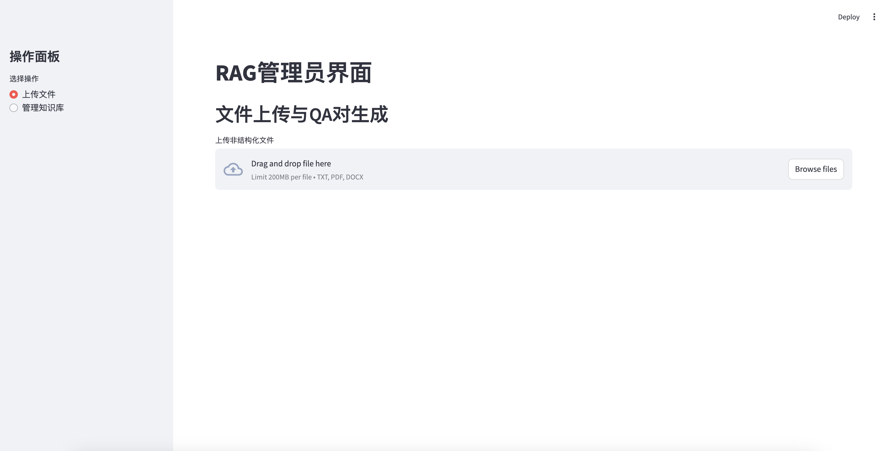

# RAG-QA-Generator
[English Version](README.md)
## 项目简介
RAG-QA-Generator 是一个用于检索增强生成（RAG）系统的自动化知识库构建与管理工具。该工具通过读取文档数据，利用大规模语言模型生成高质量的问答对（QA对），并将这些数据插入数据库中，实现RAG系统知识库的自动化构建和管理。

## 动机
在我们之前的项目实践中，传统的自动化生成方法效果不佳，而人工处理又耗时耗力。我们希望通过利用大型语言模型的智能性，开发一个自动化工具来高效生成高质量的问答对，并简化知识库的构建和管理过程。这个工具旨在提高效率、提升内容质量、减少人工干预，同时保持足够的灵活性以适应不同领域的需求。我们的目标是创建一个用户友好的系统，使得即使非技术人员也能轻松参与到RAG系统知识库的构建和维护中。

## 技术方案
我们的技术方案结合了多种先进技术来实现自动化的知识库构建和管理。首先，我们使用unstructured库处理多种格式的文档，将其分割成适当的文本块。然后，利用OpenAI的API（特别是qwen1.5-72b模型）来生成高质量的问答对。我们开发了一个基于Streamlit的Web界面，提供直观的文件上传、QA对生成预览和知识库管理功能。后端使用RESTful API与数据库交互，实现灵活的集合管理和数据存储。我们还实现了进度跟踪、错误处理和性能优化，以提高系统的可用性和效率。整个过程注重数据安全，使用临时文件处理上传的文档。这种综合方案不仅自动化了RAG系统的知识准备工作，还提供了一个可扩展、高效的解决方案。

## 安装与使用
### 先决条件
- Python 3.7+
- Streamlit
- Requests
- OpenAI Python 客户端
- unstructured 库
### 安装步骤
- 克隆此仓库：
```
git clone https://github.com/yourusername/RAG-QA-Generator.git
cd RAG-QA-Generator
```
- 安装依赖项：
```
pip install -r requirements.txt
``` 
- 配置API密钥和基础URL：
```
base_url = 'http://your-api-url/v1/'
api_key = 'your-api-key'
headers = {"Authorization": f"Bearer {api_key}"}

client = OpenAI(
    api_key="your-openai-api-key",
    base_url="http://your-openai-api-url/v1",
)
```

### 运行应用
- 启动Streamlit应用：
```
streamlit run app.py
```
- 打开浏览器并访问 http://localhost:8501。

### 使用指南
- 上传文件：
    - 在侧边栏选择 "上传文件"。
    - 上传非结构化文件（支持txt、pdf、docx格式）。
    - 点击 "处理文件并生成QA对" 按钮，系统将自动处理文件并生成QA对。
    - 预览生成的QA对。
- 管理知识库：
    - 在侧边栏选择 "管理知识库"。
    - 选择插入现有集合或创建新集合。
    - 将生成的QA对插入到选定的集合中。

### 贡献
欢迎提交问题和拉取请求。